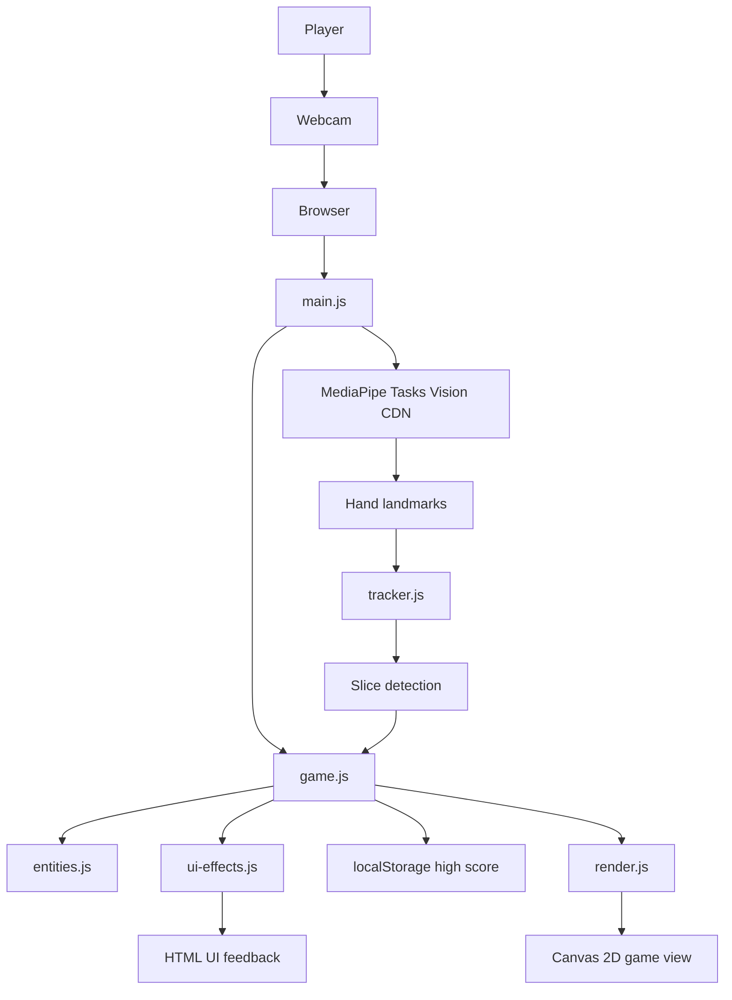

# Zlice

A browser-based fruit-slicing game controlled by webcam hand tracking.

---

## Overview

Zlice is a static web game where the player slices falling fruit by moving their index finger in front of a webcam. The application uses MediaPipe Tasks Vision to detect hand landmarks in the browser, tracks the index fingertip, and renders gameplay with the Canvas 2D API.

The project is designed as a lightweight, client-side game with no backend service. Webcam video is processed locally by the browser, while the game loop handles fruit spawning, slicing detection, scoring, combos, bombs, and end-of-round results.

Live demo:https://zlice.netlify.app/

---

## Features

- Webcam-controlled gameplay using browser camera access.
- Real-time single-hand tracking with MediaPipe HandLandmarker.
- Index-fingertip slicing based on smoothed motion history and swipe speed.
- Canvas 2D rendering for fruit, bombs, slice trails, fruit halves, and juice particles.
- 45-second timed rounds.
- Combo-based scoring where consecutive fruit slices increase points.
- Bomb objects that subtract points and reset the combo.
- High score persistence through `localStorage`.
- Start screen, game-over screen, timer, score display, combo display, and replay button.
- GPU delegate initialization with CPU fallback for MediaPipe hand tracking.
- Responsive canvas sizing with device pixel ratio handling.
- Decorative UI effects including score popups, bomb flash feedback, and mascot reactions.
- Unit tests for pure game logic, entity physics, spawning constraints, tracking math, and slice detection.

---

## Screenshots

Add screenshots to `docs/images/` and update these paths as needed.

C:\Users\admin\OneDrive\Desktop\appflow\docs\images/startscreen.png


---

## Project Architecture

Zlice runs entirely in the browser as static files. The main entry point initializes MediaPipe, requests camera access, starts the game loop, and coordinates the tracker, game state, renderer, and UI effects.



### Directory Structure

```text
.
+-- index.html          # Application markup, layout, and styling
+-- main.js             # Startup flow, camera/model initialization, and main loop
+-- game.js             # Game state, scoring, timer, spawning, and result logic
+-- entities.js         # Fruit, fruit halves, particles, and spawn helpers
+-- tracker.js          # Fingertip smoothing, velocity, and slice detection math
+-- render.js           # Canvas rendering, HUD updates, and responsive sizing
+-- ui-effects.js       # Cosmetic DOM effects and mascot reactions
+-- tracker.test.js     # Unit tests for tracking and slice detection
+-- entities.test.js    # Unit tests for entity physics and spawning
+-- package.json        # npm scripts and development dependencies
+-- package-lock.json   # Locked npm dependency versions
+-- LICENSE             # MIT license
```

---

## Tech Stack

- JavaScript ES modules
- HTML5 and CSS
- Canvas 2D API
- MediaPipe Tasks Vision
- Browser MediaDevices API
- Vitest
- Static file hosting

---

## Getting Started

### Prerequisites

- Node.js and npm
- A modern browser with webcam support
- A webcam
- Network access to the external MediaPipe library and model assets

Camera access requires `https://` or `http://localhost`. Opening `index.html` directly with `file://` is not suitable for gameplay because browsers restrict camera access in that context.

### Installation

```bash
npm install
```

### Run Locally

```bash
npm start
```

The `start` script runs `npx serve .`. Open the local URL printed in the terminal, allow camera access, and start the game.

You can also serve the folder with another static server, for example:

```bash
python -m http.server
```

---

## Available Scripts

```bash
npm start
```

Serves the project as static files.

```bash
npm test
```

Runs the Vitest test suite.

---

## Gameplay

1. Start the game and allow webcam access.
2. Move your index finger in front of the camera.
3. Swipe quickly across falling fruit to slice it.
4. Avoid bombs because they subtract points and reset the combo.
5. Score as much as possible before the 45-second timer reaches zero.

The game tracks only the first detected hand and uses landmark 8, the index fingertip, for slicing.

---

## Testing

The project includes Vitest tests for deterministic logic:

- Point-to-segment distance calculations.
- Fingertip smoothing and missed-frame behavior.
- Swipe velocity and slice detection.
- Fruit, fruit-half, and particle physics.
- Fruit spawning ranges, radius, skin assignment, and bomb probability.

Run the tests with:

```bash
npm test
```

Current verified result:

```text
Test Files  2 passed (2)
Tests       30 passed (30)
```

---

## Runtime Dependencies

The game loads MediaPipe Tasks Vision from jsDelivr and the hand landmarker model from Google Cloud Storage at runtime:

- `https://cdn.jsdelivr.net/npm/@mediapipe/tasks-vision@0.10.14`
- `https://storage.googleapis.com/mediapipe-models/hand_landmarker/hand_landmarker/float16/1/hand_landmarker.task`

If either external asset is unavailable, hand tracking will not initialize.

---

## Known Limitations

- No mouse or touch fallback is implemented.
- The game requires a webcam.
- The game tracks one hand and one fingertip only.
- MediaPipe runtime assets are loaded from external CDNs rather than self-hosted.
- Deployment details beyond static hosting are not defined in the codebase. Update as needed.

---

## Roadmap

Update as needed.

Possible future improvements based on the current implementation:

- Add mouse or touch input for devices without webcams.
- Self-host MediaPipe WASM and model assets.
- Add recorded gameplay screenshots or GIFs.
- Add broader browser compatibility notes after manual testing.

---

## License

This project is licensed under the MIT License.

Copyright (c) 2026 Aswathy. See [LICENSE](LICENSE) for details.
